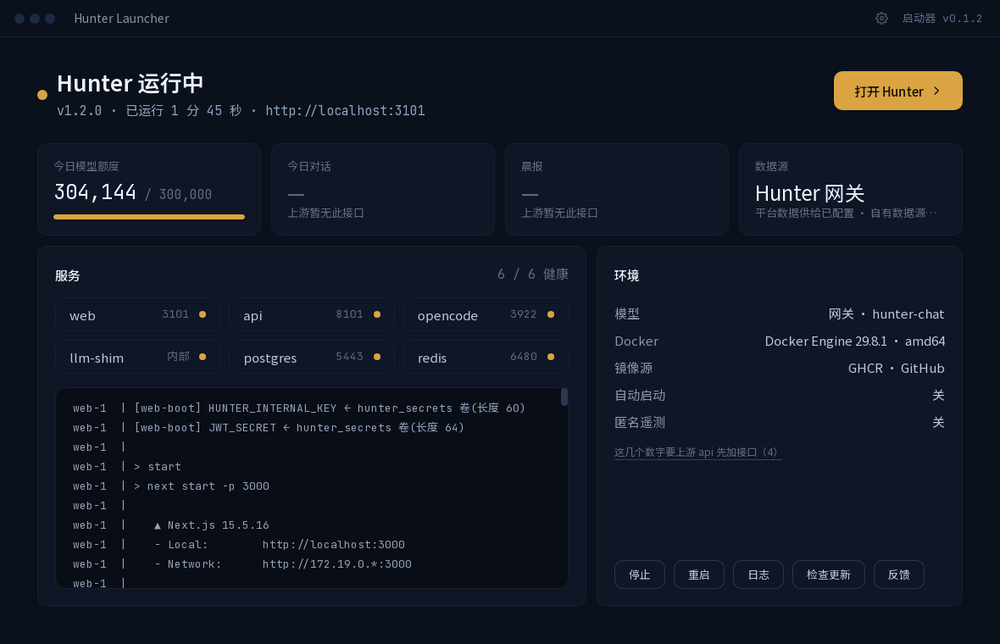
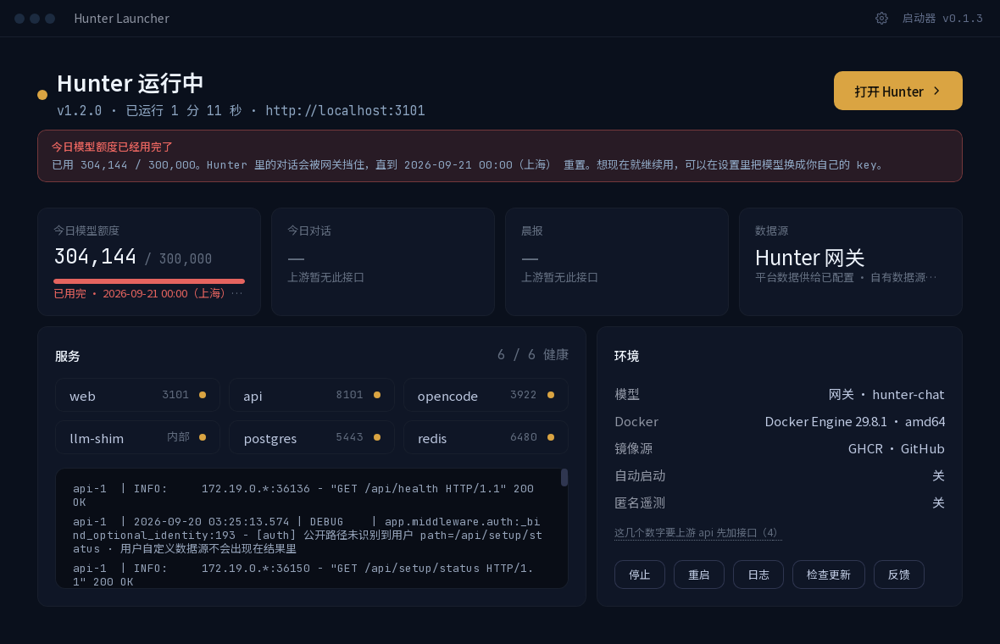

# I3 · 迭代报告

> 迭代轮 I3（持续打磨）。取活来源：[待办池.md](待办池.md) + 本轮自审 + 本轮回归撞出来的。
> 时间一律**上海时间**。所有数字都是实测；测不到的一律写「未测」并说明原因（总控规则红线 1、5）。
>
> 上一轮：[I2-迭代报告.md](I2-迭代报告.md) · 本轮发布：`launcher-v0.1.3`（仍标 prerelease）

---

## 零、一句话结论

**本轮最重要的一条又是回归撞出来的**：测试 key 的今日额度在回归途中**真的用完了**
（网关 `used_today` 304,144 / `limit_daily` 300,000、`remaining` 0、`exhausted` true），
Hunter 里的第二次提问停在「回答未完成」—— 而启动器的运行面板上只摆着
「304,144 / 300,000」两个数字，进度条还是正常的琥珀金，**一个字都没提**。
输入 key 那一页白纸黑字写着「额度用尽会明确提示，不会静默降级」，
装完之后那句话其实没有兑现。本轮把它补上了（面板横幅 + 卡片副行 + 进度条转警示色 + `--status`）。

另外修掉：更新页的卡片标题自己打自己（写着「有新版本」，正下方写「已经是最新版」）、
更新页把 GitHub 的 UTC 时间戳原样上屏、额度提醒里的裸数字与多余空格、
`--tray-menu` 打错字返回 0、`--key-file` 只写建议不查权限、
一条会跟着开发机状态走的单元测试。待办池取了三条（P1-22 / P2-16 / P2-17），
并把 I2 报告里建议的两件事做了（`.env` 写完读回来对账、GUI 回归脚本加点击断言）。

Rust 单测 **219 → 230**，前端 **59 → 63**，`fmt` / `clippy` / `eslint` / `tsc` / 字体子集 / 三个脚本自测全绿。

**P0 仍然是零。** 本轮通读代码没有找到新的 P0；上面这些都不是 P0
（额度那条不影响功能正确性，只是「该说的话没说」；其余是文案、口径、测试与内部实现）。

**待办池里剩下的都不是本项目自己能决定的事了** —— 详见 §9 与 §10。

---

## 一、本轮做了什么

| # | 事项 | 来源 | 严重度 | 状态 |
|---|---|---|---|---|
| 1 | **额度用完了，运行面板一个字都没提** | **回归实测撞出来**（用例 3） | P1（诚实性） | ✅ 修复 + 5 条单测 + 真机截图 |
| 2 | **Podman 4.x 被误判成「Docker 装了但 daemon 没起」** | 待办池 P1-5 / P2-12 | P1 | ✅ 真装 podman 验出来 + 修复 + 3 条单测 |
| 3 | 更新页卡片标题自己打自己（「有新版本」/「已经是最新版」） | **本轮自审**（回归截图） | P1（文案） | ✅ 修复 |
| 4 | 更新页把 GitHub 的 UTC 时间戳原样上屏 | **本轮自审**（回归截图） | P2（口径） | ✅ 修复 + 4 条单测 |
| 5 | 额度提醒里数字是裸的、句子里多一个空格 | **本轮自审**（回归截图） | P2（文案） | ✅ 修复 + 2 条单测 |
| 6 | `--tray-menu` 打错一个字母会「成功」（退出码 0） | **本轮自审** | P2（诚实性） | ✅ 修复 + 2 条单测 |
| 7 | `--key-file` 帮助里写「建议 600」但从不检查 | **本轮自审** | P2（安全提醒） | ✅ 修复 + 真机验证 |
| 8 | 一条单测会跟着**开发机的真实状态**走 | **本轮回归撞出来** | P2（测试质量） | ✅ 修复 |
| 9 | `registry::custom()` 的 `Box::leak` | 待办池 P1-22 | P1（内部） | ✅ 换成 `Cow`，`Box::leak` 清零 + 3 条单测 |
| 10 | `~/.hunter/app/VERSION` 是 644 | 待办池 P2-16 | P2 | ✅ 收成 600 + 单测扩到五个文件 |
| 11 | CI 里给安装包改名把版本号拼进了源文件名 | 待办池 P2-17 | P2 | ✅ 改成按前缀替换 |
| 12 | `.env` 只有「写之前查」，没有「写完对账」 | I2 报告第十节建议 4 | — | ✅ 写完读回来逐项对账 + 4 条单测 |
| 13 | GUI 回归点空了要到最后一步才发现 | I2 报告第十节建议 5 | — | ✅ `scripts/gui-session.sh`，**本轮第一遍就当场抓到一次** |

---

## 二、详解：额度用完了，运行面板一个字都没提

### 2.1 怎么撞上的

回归的第一步（命令行从零装）里，key 校验那一行是这样的：

```
  ✓ key 有效 · 今日已用 216406 / 300000 · 剩 83594 · 每分钟 20 次 · 并发 4
```

装完之后跨机做真实对话（用例 3），第一个问题（600519 贵州茅台）**工具真调、答案真出**。
紧接着问第二个（000858 五粮液），界面停在「回答未完成」。查网关：

```json
{"ok":true,"used_today":304144,"limit_daily":300000,"remaining":0,"exhausted":true,
 "reset_at":"2026-09-21T00:00:00+08:00","reset_tz":"Asia/Shanghai",
 "rate_per_min":20,"max_concurrency":4,"enabled":true,"global_exhausted":false}
```

额度真的用完了（一次带深度思考的对话吃掉了剩下的 8 万多 token）。
**问题不在这里 —— 问题在回到启动器之后**：



面板上只有「304,144 / 300,000」两个数字，进度条是正常的琥珀金，
**没有任何一个字说「用完了」**。用户在 Hunter 里对话被挡住，回到启动器看不出原因。

而输入 key 那一页写着（`i18n/zh-CN.ts` 的 `model.gatewayPoints`）：

> 对话模型 hunter-chat · 深度分析 hunter-deep · **额度用尽会明确提示，不会静默降级**

装之前承诺了，装之后没做到。`--status` 也一样 —— 只打「剩 0」，要用户自己做减法。

### 2.2 为什么会这样

数据一直都在：`QuotaInfo` 从 M2 起就有 `exhausted` 字段（网关给的，读不到时按
`remaining <= 0` 兜底），前端的 `QuotaInfo` 类型里也有。
**只有输入 key 那一页用了它**（I1 加的，见 `Key.tsx` 的 `key-exhausted`）。
运行面板从来没读过这个字段 —— 它只画了 `usedToday / limitDaily` 和一根进度条。

这是典型的「一处做对了就以为全做对了」：I1 修的是**安装时**的提醒，
而额度用尽这件事**绝大多数时候发生在装完很久之后**，那时用户看的是运行面板。

### 2.3 修了什么

1. **运行面板加一条横幅**（红色描边 + `bg-danger-soft`），写清三件事：用了多少 /
   什么时候重置 / 现在就想用该怎么办。只在网关明确说 `exhausted` 时出现，
   额度读不到就什么都不说（红线 1）。
2. **额度卡**副行写「已用完」（红色），进度条转警示色。
   副行不写重置时间 —— 卡片只有面板四分之一宽，写长了会被 `truncate` 截掉半句话；
   完整的一句由上面那条横幅说。
3. **`--status`** 同样：

```
额度：今日已用 304,144 / 300,000 · 已用完
      Hunter 里的对话会被网关挡住，直到 2026-09-21 00:00（上海） 重置；想现在就用就在设置里换成自带模型 key。
```

4. 重置时间的格式两边统一：Rust 侧 `gateway::pretty_reset`、前端 `format.ts` 的
   `shanghaiStamp()`，规则一样（只砍格式、**不做时区换算** —— 网关自己在
   `reset_tz` 里写明了是 `Asia/Shanghai`），两边各有一份测试盯着同样的样本。

修完的样子：



这张图里的额度是**真的**用完的（回归当天的真实状态），不是演示数据。

---

## 三、详解：Podman 到底能不能跑（待办池 P1-5 / P2-12）

这一条从 M0 挂到现在，理由一直是「装了会和 Docker 抢资源」。本轮把它做掉了，
**做法上没有动这台机器上真实的 Docker**：

* **不装 `podman-docker`** —— 它会往 `/usr/bin/docker` 上放一个指向 podman 的软链，
  把测试机上跑着的两套 Hunter（启动器的 `hunter` 与旧栈 `hunter-community`）全带下水；
* 改成 `apt install podman` 之后，在 `/tmp/podman-shim/` 里放一个叫 `docker` 的软链指向
  `/usr/bin/podman`，**只在这一次测试的 `PATH` 里生效**，测完删掉。

### 3.1 实测出来的事实，和代码里的假设正好相反

代码里原本的假设是：「`docker version --format json` 的输出**不是 JSON** 时，
看看里面有没有 `podman` 字样」。真实情况是：

```console
$ docker version --format json       # 这个 docker 其实是 podman 4.9.3
{"Client":{"APIVersion":"4.9.3","Version":"4.9.3","GoVersion":"go1.22.2",
 "GitCommit":"","BuiltTime":"Thu Jan  1 00:00:00 1970","Built":0,
 "OsArch":"linux/amd64","Os":"linux"}}
```

1. 它是**合法的 Docker 形状 JSON**，`parse_version` 解析得动 —— 于是
   「不是 JSON 才认 podman」那条分支**永远轮不到**，是死代码；
2. 整段里**一个 `podman` 字样都没有**。

结果：用户明明装着能用的 podman，启动器却说

```
✗ Docker 客户端在，但连不上后台服务（daemon）。
  在 Linux 上装 Docker
   · 官方便利脚本：curl -fsSL https://get.docker.com | sh …
```

—— 话说错了，而且把人往一条不必要的路上带。

### 3.2 第一版的修法栽了一次

第一版改成「没有 Server 时再跑一次 `docker --version`」。真机上：

```console
$ docker --version        # 通过名为 docker 的软链调用 podman
docker version 4.9.3
```

**podman 用 `argv[0]` 当程序名** —— 通过软链调用时它把自己叫「docker」。
于是 `classify_plain` 匹配到 `docker` → 判成 Docker Engine，比原来还糟。
这一次是靠真机跑出来的，单测再多也想不到。

### 3.3 最后的修法（两道，都与 `argv[0]` 无关）

1. **`OsArch` 这个键**。podman 的 Client 块有 `"OsArch":"linux/amd64"`；
   Docker 那边是分开的 `Os` + `Arch`，**从来不发 `OsArch`**。同一台机器上取的对照：

   | | podman 4.9.3 | docker 29.8.1 |
   |---|---|---|
   | Client 里的键 | `APIVersion` `Version` `GoVersion` `GitCommit` `BuiltTime` `Built` **`OsArch`** `Os` | `Platform` `Version` `ApiVersion` `DefaultAPIVersion` `GitCommit` `GoVersion` `Os` `Arch` `Context` |

   这一道**不用多跑任何进程**。

2. **`docker version`（不带 `--format`）的第一行**，作为第二道保险：

   ```
   Client:       Podman Engine          ← podman
   Client: Docker Engine - Community    ← docker
   ```

   这一行由 podman 自己写死，和 `argv[0]` 无关。只在「JSON 解析成功但没有 Server」
   这条失败路径上跑一次，正常安装一个进程都没多跑。

认出来之后说的话**不假装支持**（红线 1）：

```
✗ 命令行里的 docker 实际上是 Podman 4.9.3，不是 Docker，而且现在连不上它的服务。
  Podman 目前是**实验支持**：启动器认得出它，但整套安装从来没有在 Podman 上跑通过 ——
  `docker compose` 在 Podman 上要另外装一个 compose provider（podman-compose 或
  docker-compose），没有它 Hunter 起不来。最稳的做法是装 Docker Engine；一定要用
  Podman 的话，请先确认 `docker compose version` 有输出，再用 `podman system service`
  把服务起起来。
```

### 3.4 这一轮**没有**验到的（如实写）

| 问题 | 结论 |
|---|---|
| 启动器能不能认出 Podman | ✅ **验了**，能，退出码 1，文案是 Podman 专属的那一段 |
| Hunter 整套能不能在 Podman 上跑起来 | ❌ **没验**。要 `podman system service` 起 socket、要装 compose provider、六个容器要重新拉一遍 —— 在一台 2 核 8G、已经跑着 12 个容器的机器上做这件事会把现有两套栈挤垮 |
| Podman 上的 `docker compose` 是不是可用 | ❌ **测不出可信结论**。这台机器上 `docker compose version` 在 podman 的 PATH 下**仍然返回 v5.5.1** —— 因为 podman 4.9 会去找外部 compose provider，而它正好找到了**这台机器上真实 Docker 的** `/usr/libexec/docker/cli-plugins/docker-compose`。一台只有 podman 的机器上不会是这个结果，所以这个数字不算数 |

所以待办池里 P1-5 / P2-12 的状态从「完全未验证」变成「**识别这一步验过了，能跑起来没验过**」，
并且启动器现在**明说自己没验过**，而不是给一句含糊的「实验支持」。

